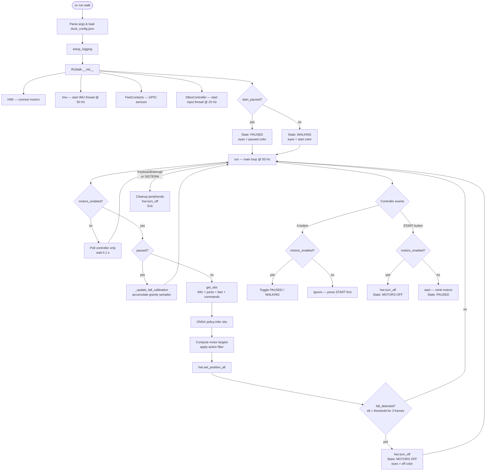

# Open Duck Mini Runtime

Runtime software for the [Open Duck Mini](https://github.com/apirrone/Open_Duck_Mini) – a small, open-source robotic duck that walks using a reinforcement-learning policy.

---

## Table of Contents

- [Quick Start](#quick-start)
- [Raspberry Pi Setup](#raspberry-pi-setup)
  - [Install Raspberry Pi OS](#install-raspberry-pi-os)
  - [Setup SSH](#setup-ssh)
  - [System Updates and Dependencies](#system-updates-and-dependencies)
  - [Enable I2C](#enable-i2c)
  - [Set the USB Serial Latency Timer](#set-the-usb-serial-latency-timer)
  - [Motor Control Board udev Rules](#motor-control-board-udev-rules)
- [Install the Runtime](#install-the-runtime)
- [Configuration](#configuration)
  - [duck_config.json Reference](#duck_configjson-reference)
  - [Controller Types](#controller-types)
  - [Generic USB Controller Mapping](#generic-usb-controller-mapping)
  - [Remote Control (gamepad on a separate PC)](#remote-control-gamepad-on-a-separate-pc)
  - [Telemetry & Eye Color (from a separate PC)](#telemetry--eye-color-from-a-separate-pc)
  - [Web Control UI (phone browser, no PC app needed)](#web-control-ui-phone-browser-no-pc-app-needed)
- [Hardware Configuration](#hardware-configuration)
  - [Speaker Wiring](#speaker-wiring)
- [Testing and Calibration](#testing-and-calibration)
  - [Test the IMU](#test-the-imu)
  - [Find Joint Offsets](#find-joint-offsets)
- [Running the Duck](#running-the-duck)
  - [Gamepad Walking](#gamepad-walking)
  - [SSH Keyboard Walking](#ssh-keyboard-walking)
- [Controls Reference](#controls-reference)
  - [Xbox / DualSense Controls](#xbox--dualsense-controls)
  - [Keyboard Controls (SSH)](#keyboard-controls-ssh)
- [Code Structure](#code-structure)
- [System Flow](#system-flow)
- [Running Tests](#running-tests)

---

## Quick Start

```bash
# 1. Install uv (if not already installed)
curl -LsSf https://astral.sh/uv/install.sh | sh

# 2. Clone and enter the repo
git clone https://github.com/apirrone/Open_Duck_Mini_Runtime
cd Open_Duck_Mini_Runtime

# 3. Install all dependencies into a managed virtual environment
uv sync

# 4. Walk!
uv run walk
```

---

## Raspberry Pi Setup

These instructions target a **Raspberry Pi Zero 2W** running Raspberry Pi OS Lite (64-bit).

### Install Raspberry Pi OS

1. Download [Raspberry Pi OS Lite (64-bit)](https://www.raspberrypi.com/software/operating-systems/).
2. Flash it with the [Raspberry Pi Imager](https://www.raspberrypi.com/documentation/computers/getting-started.html).
3. In the Imager's advanced options, pre-configure your username, Wi-Fi, and SSH key.

> **Tip:** Configure Wi-Fi to connect to your phone's hotspot for easy field access.

### Setup SSH

If SSH was not enabled during imaging, connect a screen and keyboard, then:

1. Connect to a Wi-Fi network.
2. Enable SSH: [Raspberry Pi SSH guide](https://www.raspberrypi.com/documentation/computers/configuration.html#setting-up-wifi).

### System Updates and Dependencies

```bash
sudo apt update && sudo apt upgrade -y
sudo apt install -y git curl

# Install uv
curl -LsSf https://astral.sh/uv/install.sh | sh

# Optional: camera support
sudo apt install -y python3-picamzero
```

### Enable I2C

```bash
sudo raspi-config
# Interface Options → I2C → Enable
```

### Set the USB Serial Latency Timer

```bash
sudo nano /etc/udev/rules.d/99-usb-serial.rules
```

Add:
```
SUBSYSTEM=="usb-serial", DRIVER=="ftdi_sio", ATTR{latency_timer}="1"
```

### Motor Control Board udev Rules

*(TODO)*

---

## Install the Runtime

```bash
git clone https://github.com/apirrone/Open_Duck_Mini_Runtime
cd Open_Duck_Mini_Runtime
uv sync
```

**Raspberry Pi 5 only** — replace the GPIO library after sync:
```bash
uv pip uninstall RPi.GPIO
uv pip install lgpio
```

---

## Configuration

### duck_config.json Reference

Copy the example config to your home directory:
```bash
cp example_config.json ~/duck_config.json
```

| Field | Type | Default | Description |
|---|---|---|---|
| `start_paused` | bool | `false` | Start the walk loop paused — press **A** to begin walking |
| `imu_upside_down` | bool | `false` | Flip IMU orientation for inverted mounting |
| `phase_frequency_factor_offset` | float | `0.0` | Offset added to the gait phase frequency |
| `log_level` | string | `"INFO"` | Logging verbosity: `TRACE`, `DEBUG`, `INFO`, `WARNING`, `ERROR` |
| `fall_detection` | bool | `true` | Enable automatic motor cut-off on detected fall |
| `fall_threshold_deg` | float | `45.0` | Tilt angle (degrees) that triggers fall detection |
| `eye_colors.start` | `[R,G,B]` or string | `[255,255,255]` | Eye color when walking/unpaused |
| `eye_colors.paused` | `[R,G,B]` or string | `[255,105,180]` | Eye color when paused (motors on) |
| `eye_colors.off` | `[R,G,B]` or string | `[255,0,0]` | Eye color when motors are disabled |
| `controller_type` | string | `"xbox"` | Which controller to use — see [Controller Types](#controller-types) |
| `expression_features.eyes` | bool | `false` | Enable NeoPixel eye LEDs |
| `expression_features.projector` | bool | `false` | Enable NeoPixel projector LED |
| `expression_features.sounds` | bool | `false` | Enable audio playback |
| `expression_features.antennas` | bool | `false` | Enable servo-driven antennas |
| `joints_offsets` | object | all `0.0` | Per-joint offset corrections (radians) |
| `led_counts.projector` / `.right_eye` / `.left_eye` | int | `1` each | NeoPixel count per strip segment. Only used when `neopixels=true` |
| `led_brightness.projector` / `.right_eye` / `.left_eye` | float | `1.0` each | Per-segment brightness (0.0-1.0), applied once at startup. Only used when `neopixels=true` |
| `speaker_volume` | float | `1.0` | Playback volume (0.0-1.0), applied once at startup. Only used when `expression_features.speaker=true` |
| `imu_trim.pitch` / `.roll` | float | `0.0` | Residual IMU mounting-tilt correction (radians) — live-tunable from `/control` |
| `stability_governor.enabled` | bool | `false` | Ease drive commands when tipping, upstream of fall detection — see [Web Control UI](#web-control-ui-phone-browser-no-pc-app-needed) |
| `action_scale` | float | `0.25` | Policy residual scale — live-tunable from `/control` |
| `velocity_clip` | bool | `false` | Persisted/tunable for parity; enforcement not implemented yet |
| `max_motor_velocity_rad_s` | float | `5.24` | Persisted/tunable for parity; enforcement not implemented yet |
| `battery.v_min` / `.v_max` / `.v_full` | float | 2S LiPo defaults | `/control`'s battery gauge thresholds — voltage read via a brief servo-bus handoff, paused-only |

### Controller Types

Set `"controller_type"` in `~/duck_config.json` to one of:

| Value | Description |
|---|---|
| `"xbox"` | Xbox One / Xbox Series controller via Bluetooth |
| `"dualsense"` | PlayStation 5 DualSense controller via Bluetooth or USB |
| `"generic_usb"` | Any SDL2-compatible USB gamepad with a configurable axis/button map |
| `"keyboard"` | WASD keyboard input via raw stdin — ideal for SSH sessions |

### Generic USB Controller Mapping

When using `"controller_type": "generic_usb"`, add an optional `generic_usb_controller` block to your config (defaults shown):

```json
{
  "controller_type": "generic_usb",
  "generic_usb_controller": {
    "joystick_index": 0,
    "axis_map": {
      "left_x": 0,
      "left_y": 1,
      "right_x": 2,
      "right_y": 3,
      "left_trigger": 4,
      "right_trigger": 5
    },
    "button_map": {
      "A": 0,
      "B": 1,
      "X": 2,
      "Y": 3,
      "LB": 4,
      "RB": 5
    }
  }
}
```

### Remote Control (gamepad on a separate PC)

If you'd rather plug/pair a gamepad into a desktop PC or Steam Deck instead
of pairing it directly to the duck, enable `remote_control` in
`duck_config.json`:

```json
{
  "remote_control": {
    "enabled": true,
    "port": 10000
  }
}
```

With this enabled, `walk` listens for gamepad commands over UDP on that
port instead of reading a locally paired gamepad. Leave it disabled (the
default) to keep controlling the duck with a gamepad — including a
Bluetooth one — paired directly to it, exactly as before.

On the PC (Windows, Linux, or Steam Deck in Desktop Mode), install and run
the relay app in `remote_control/`:

```bash
cd remote_control
uv sync
uv run duck-remote --host <duck-ip>
```

It reads the local gamepad and streams commands to the duck; the duck does
all axis scaling/range clamping itself, so a compromised or buggy remote
client can't push the robot outside its configured physical limits. Notes:

- **WSL**: raw USB gamepad passthrough isn't automatic under WSL2 — run
  `duck-remote` as a native Windows process, or set up
  [usbipd-win](https://github.com/dorssel/usbipd-win) if you specifically
  need it inside WSL.
- **Network trust**: the duck accepts UDP control packets from anyone who
  can reach `port` on its network — only enable this on a network you
  trust.

To test the relay without a robot, run `uv run duck-remote-fake-host` in one
terminal and `uv run duck-remote --host 127.0.0.1` in another — it decodes
and pretty-prints packets the same way `RemoteController` would, including
the mode toggle and disconnect fail-safe.

### Telemetry & Eye Color (from a separate PC)

The same `web_stats` server (see [duck_config.json Reference](#duck_configjson-reference))
also serves live telemetry and eye-color control once enabled:

```json
{
  "web_stats": {
    "enabled": true,
    "port": 8080
  }
}
```

| Endpoint | Method | Description |
|---|---|---|
| `/telemetry` | GET | Joint positions/targets, IMU (gyro/accel/gravity, plus cosmetic pitch/roll in degrees), foot contacts, paused/motors_enabled |
| `/eye_colors` | GET | Currently configured `eye_colors` (start/paused/off) |
| `/eye_colors` | POST | `{"color": [r,g,b]}` to preview a color live, or `{"clear": true}` to stop previewing |

The eye-color POST is a **live-only preview** — it calls `Eyes.set_color()`
directly on the running process and is never written to `duck_config.json`;
a restart or the next pause/unpause transition reverts to the configured
colors. `/telemetry` reads a snapshot cached once per control tick rather
than touching the servo bus directly, since that's only safe from the main
control loop.

From the PC:

```bash
cd remote_control
uv run duck-remote-telemetry --host <duck-ip>        # live dashboard
uv run duck-remote-eyes --host <duck-ip> --color 255,0,0
uv run duck-remote-eyes --host <duck-ip> --clear
uv run duck-remote-eyes --host <duck-ip> --status
```

### Web Control UI (phone browser, no PC app needed)

With `web_stats.enabled` set, the same server also serves a touch-control page
at `http://<duck-ip>:<port>/control` — joystick + A/B/X/Y/LB/RB/dpad, pause/
resume, live IMU-trim nudging, live walk-tuning (action_scale, gait offset,
stability governor), live per-segment LED brightness (projector/left eye/
right eye), speaker volume, eye color, an attitude indicator (artificial
horizon showing live pitch/roll, red alarm ring when `fallen`), and a battery
gauge. No install needed — just open the URL on a phone or any browser on the
same network.

It's backed by `ControlBus` (`rl_walk/control_bus.py`), a third, independent
way to drive `RLWalk` alongside `XBoxController`/`RemoteController` — the web
sticks override the gamepad's only while actively posted (releasing/closing
the tab hands control straight back to the pad), buttons OR together into the
same edge-detector, and triggers are the max of both sources. `/api/*` routes:

| Endpoint | Method | Description |
|---|---|---|
| `/api/command` | POST | `{"active": bool, "l_x", "l_y", "r_x", "r_y", "left_trigger", "right_trigger"}` — virtual sticks |
| `/api/button` | POST | `{"button": "A", "action": "press"\|"down"\|"up"}` — `A B X Y LB RB dpad_up dpad_down dpad_left dpad_right` |
| `/api/trim` | POST | `{"axis": "pitch"\|"roll", "delta": 0.002}` to nudge, or `{"action": "save"}` to persist |
| `/api/setting` | POST | `{"group": "walk"\|"led_brightness"\|"speaker", "key": ..., "value": ...}` to edit live, or `{"group": ..., "action": "save"\|"reset"}` |

**IMU trim** (`imu_trim` in `duck_config.json`) corrects small residual mounting
tilt the BNO055 axis-remap can't — a rotation applied to accel/gyro/gravity in
`hardware/imu_trim.py`, tuned live and clamped to ±0.1 rad. **Walk tuning**
(`action_scale`, `velocity_clip`, `max_motor_velocity_rad_s`) and the
**stability governor** (`stability_governor` — eases drive commands, not head
commands, when tipping) live under the same `"walk"` settings group and both
save/reset together. The governor is disabled by default (pure pass-through)
and sits strictly *upstream* of fall detection — it's an additional layer, not
a replacement; fall detection's pause+motors-off safety net is unchanged.
`velocity_clip` is exposed/persisted for parity but per-tick clipping
enforcement isn't implemented yet, so toggling it doesn't currently change
motor behavior. **LED brightness** (`led_brightness` — `projector`/`left_eye`/
`right_eye`, same shape as `led_counts`) is its own settings group, applied
live to `Eyes`/`Projector` and saved/reset independently of walk tuning.
**Speaker volume** (`speaker_volume`, key `"volume"` in the `"speaker"` group)
works the same way, applied via `Sounds.set_volume()`. In both cases, a
feature that isn't enabled just doesn't audibly/visibly change — the value is
still tracked and persists on Save. The battery gauge is read via `HWI.read_battery_handoff()` —
`rustypot` 0.1.0 doesn't expose voltage/temperature registers, so this briefly
releases the servo connection, reads through `pypot` instead, then always
reconnects `rustypot` before returning (paused-only, throttled to a few
seconds — see its docstring for the safety reasoning).

---

## Hardware Configuration

### Speaker Wiring

Follow the [Adafruit MAX98357 I2S Class-D Mono Amp](https://learn.adafruit.com/adafruit-max98357-i2s-class-d-mono-amp?view=all) tutorial for wiring.

> **Note:** Do **not** activate `/dev/zero` when prompted by the tutorial.

---

## Testing and Calibration

### Test the IMU

```bash
# Quick sanity check
python3 src/open_duck_mini_runtime/hardware/raw_imu.py

# Visualise IMU data (server on robot, client on your machine)
python3 dev/hardware/imu_server.py                   # on the robot
python3 dev/hardware/imu_client.py --ip <robot_ip>   # on your machine
```

Use `ifconfig` on the robot to find its IP address.

### Find Joint Offsets

This script guides you through finding the correct resting-position offsets for each servo. Add the reported values to `~/duck_config.json` under `joints_offsets`.

```bash
python3 tools/find_soft_offsets.py
```

> **Note:** This step will eventually be replaced by flashing offsets into each motor's EEPROM.

---

## Running the Duck

### Gamepad Walking

Use an Xbox One, Xbox Series, or DualSense controller paired over Bluetooth (or DualSense via USB).

```bash
uv run walk                           # uses ~/duck_config.json
uv run walk --help                    # show all options
uv run walk --onnx_model_path /path/to/model.onnx
uv run walk --log-level DEBUG         # verbose logging (overrides config)
```

**Xbox One Controller Bluetooth Pairing**

1. Long-press the sync button on the controller to enter pairing mode.
2. On the Pi:
   ```bash
   bluetoothctl
   scan on
   # wait for your controller MAC to appear, then:
   pair    <MAC>
   trust   <MAC>
   connect <MAC>
   ```

### SSH Keyboard Walking

Walk the duck entirely over SSH — no Bluetooth controller required.

```bash
uv run walk-keyboard                  # uses ~/duck_config.json
uv run walk-keyboard --help           # show all options
```

The terminal switches to raw mode while running. Press **Space** to pause, **Ctrl-C** to quit.

---

## Controls Reference

### Xbox / DualSense Controls

| Input | Action |
|---|---|
| **Left stick** | Forward / Back / Strafe |
| **Right stick X** | Turn left / right |
| **LB (hold)** | Sprint (increase walk frequency) |
| **D-pad up / down** | Increase / decrease phase frequency offset |
| **A** | Pause / Unpause walking |
| **START** | Toggle motors on/off (re-enables in paused state; press A to walk) |
| **X** | Toggle projector |
| **B** | Play a random sound |
| **Y** | Toggle head control *(experimental)* |
| **Left trigger** | Left antenna |
| **Right trigger** | Right antenna |

### Keyboard Controls (SSH)

| Key | Action |
|---|---|
| **W / S** | Forward / Backward |
| **A / D** | Turn left / Turn right |
| **Q / E** | Strafe left / Strafe right |
| **L (hold)** | Sprint (increase walk frequency) |
| **Space** | Pause / Unpause |
| **X** | Toggle projector |
| **B** | Play a random sound |
| **P** | Toggle head control *(experimental)* |

---

## Code Structure

The package is organised into three submodules plus shared top-level utilities:

```
src/open_duck_mini_runtime/
│
├── duck_config.py          # Config loading (shared by all submodules)
├── log.py                  # Logging setup + custom TRACE level
│
├── hardware/               # Physical hardware drivers
│   ├── hwi.py              #   Motor hardware interface (Feetech servos)
│   ├── raw_imu.py          #   BNO055 IMU — gyro, accelerometer, gravity
│   ├── imu_trim.py         #   Residual mounting-tilt correction (pure math)
│   ├── imu.py              #   BNO055 IMU — quaternion/Euler mode
│   ├── feet_contacts.py    #   GPIO foot contact sensors
│   ├── eyes.py             #   NeoPixel eye LEDs with blink thread
│   ├── led_controller.py   #   Low-level NeoPixel controller
│   ├── projector.py        #   NeoPixel projector LED
│   ├── antennas.py         #   PWM servo antennas
│   ├── sounds.py           #   Audio playback (pygame mixer)
│   └── camera.py           #   Camera capture
│
├── controller/             # Gamepad / keyboard input
│   ├── xbox_controller.py  #   Xbox / generic pygame joystick
│   ├── remote_controller.py#   UDP-sourced controller for a PC-side relay
│   ├── command_shaping.py  #   Axis→command scaling, shared by both controllers
│   └── buttons.py          #   Button debounce state machine
│
└── rl_walk/                # RL policy and main walk loop
    ├── walk.py             #   RLWalk — main 50 Hz control loop
    ├── stats_server.py     #   Stats/telemetry/eye-color/control HTTP server (web_stats)
    ├── control_bus.py      #   Thread-safe input bus for the /control web UI
    ├── stability_governor.py  # Tilt-based drive-command easing (pure logic)
    ├── battery.py          #   Voltage → percent/charging estimate (pure logic)
    ├── walk_defaults.py    #   Known-good walk-tuning / IMU-trim reset targets
    ├── webui/control.html  #   Single-file phone control page served at /control
    ├── onnx_infer.py       #   ONNX model inference wrapper
    ├── poly_reference_motion.py  # Polynomial gait reference
    └── rl_utils.py         #   Action filters, coordinate helpers
```

`remote_control/` at the repo root is a separate, standalone package (its
own `pyproject.toml`) meant to run on a PC/Steam Deck rather than the duck —
see [Remote Control](#remote-control-gamepad-on-a-separate-pc) above:

```
remote_control/src/duck_remote/
├── relay.py             # duck-remote — gamepad → UDP relay to the duck
├── gamepad_reader.py    #   Local gamepad capture (pygame SDL_GameController)
├── command_shaping.py   #   Mirrors the duck's axis→command scaling (preview only)
├── fake_host.py         # duck-remote-fake-host — local test receiver for the relay
├── eyes_cli.py          # duck-remote-eyes — preview/clear/status eye color
└── telemetry_cli.py     # duck-remote-telemetry — live joint/IMU dashboard
```

---

## System Flow



---

## Running Tests

### Unit Tests (no hardware required)

```bash
uv run pytest
```

Covers duck_config parsing, button state machine, keyboard controller commands, controller dispatch, and RL utilities. No connected robot needed.

### Hardware Integration Tests

These tests require the duck to be plugged in and powered on (`/dev/ttyACM0`).

```bash
uv run pytest -m hardware
```

Runs `tests/test_servo_presence.py`, which polls each of the 14 servos individually and reports any that do not respond.

To explicitly exclude hardware tests during normal development:

```bash
uv run pytest -m "not hardware"
```
